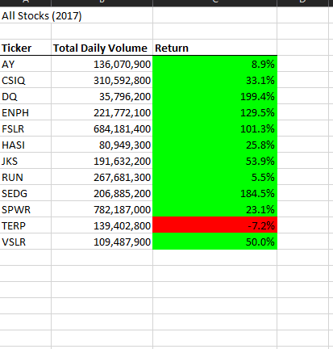
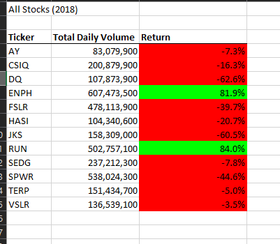
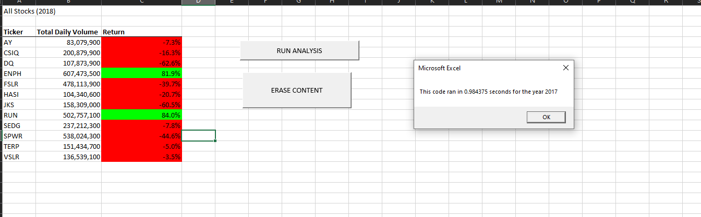
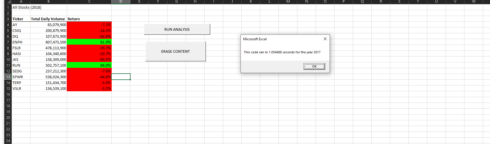
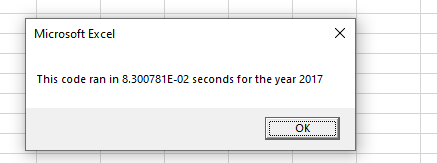
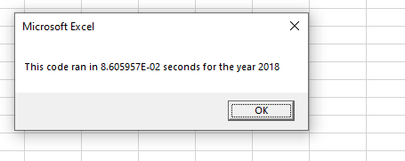
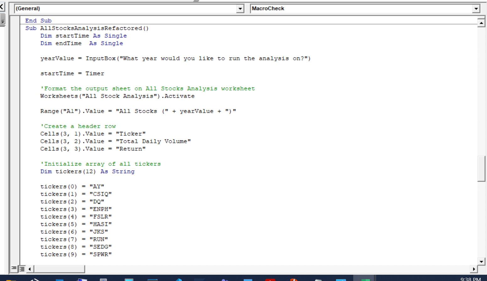
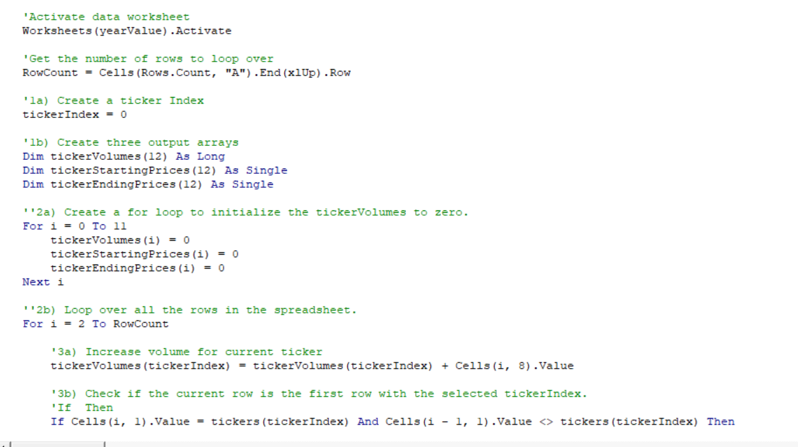
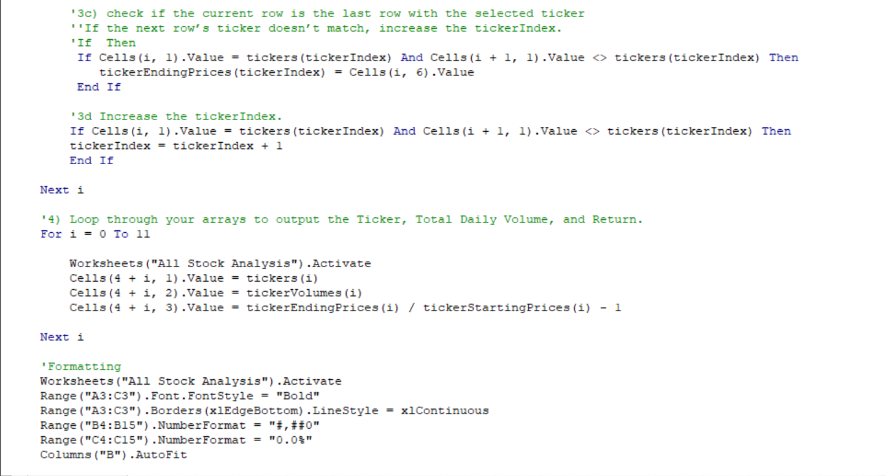
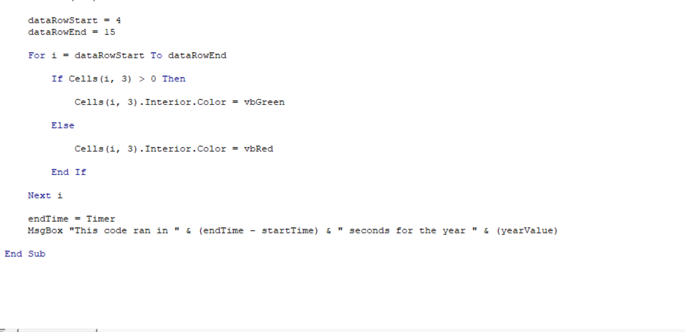

# VBA_challenge
## Overview of Project
### Background
As a recent Graduate, Steve wants to help his parents to find what could be the best investment for them. In order to do so, Steve asked for our help to Analyze a group of stocks from 2017 and 2018, he wants us to run that Data through VBA to see what stocks would be of greater opportunity for his parents.

### Purpose

the purpose of this challenge is to use the coding built through out the unit  and refactor it in order to obtain a most accurate and faster report

### Results

When running the Analysis we found that only 2 stocks were profitable through both years, these were "ENPH" and "RUN". if I was to do a suggestion to Steve's Parent I would say that they should invest in ENPH, during 2017 they stocks had a return of 129.5% and during 2018 it had the higher return from all the stock. A second choice would be to invest in "RUN" which also had a positive return in 2018.

### Refactoring Results

The return results are the same but the time of the Analysis changes by a lot as seen in images below.

These are the times after refactoring the data.

Coding:

## Summary

### Advantages and Disadvantages of refacturing code

An advantage of refactoring is cut the number of lines and once you are comfortable coding it will help you as an analyst to cut the time of an Analysis.

A disadvantage is for beginner coders, it takes a bit to feel comfortable and being able to write the right lines of codes wihout producing bugs

### Advantages and Dusadvatages of refactoring VBA Code

I think that by refactoring the VBA you will see the difference in time when running large amounts of Data, this challenge is not a huge example but with more data it would take more time to Analyze big sets of Data,

The disadvantage when refactoring code in VBA is you can cause Bugs that could affect time when running reports and Analyzing reports.

